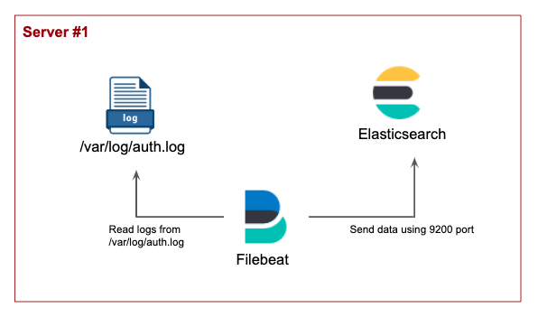

# Environments
* Ubuntu : 18.04
* Elasticsearch : 7.0
* Filebeat : 7.0

# Install and run
### 1. Elasticsearch
https://www.elastic.co/guide/en/elasticsearch/reference/current/getting-started-install.html

### 2. Filebeat
https://www.elastic.co/guide/en/beats/filebeat/current/filebeat-installation.html


# Elasticsearch + Filebeat
In this section, Filebeat reads the /var/log/auth.log and sends it to Elasticsearch

### 1. Architecture


### 2. Send auth.log to Elasticsearch
Before running Filebeat, install and run Elasticsearch
#### 1) Configure Filebeat input/output
```shell
# <Filebeat home>/filebeat.yml

filebeat.inputs:
- type: log
  enabled: true
  paths:
    - /var/log/auth.log
    
output.elasticsearch:
  hosts: ["localhost:9200"]

```
Run Filebeat!!!
  
#### 2) Check log in Elasticsearch
A new index was created, called 'filebeat-7.0.0-2019.04.11-000001'<br>
There are 187 of docs created by auth.log
```shell
vanryuji@instance-4:/$ curl -X GET "localhost:9200/_cat/indices?v"
health status index                            uuid                   pri rep docs.count docs.deleted store.size pri.store.size
yellow open   filebeat-7.0.0-2019.04.11-000001 Iu4G-mflQWSWfoVC4jOT9g   1   1        187            0      117kb          117kb
```

If you make a new login to your server, the count of docs will be increase
```shell
# After new login

vanryuji@instance-4:/$ curl -X GET "localhost:9200/_cat/indices?v"
health status index                            uuid                   pri rep docs.count docs.deleted store.size pri.store.size
yellow open   filebeat-7.0.0-2019.04.11-000001 Iu4G-mflQWSWfoVC4jOT9g   1   1        219            0    139.6kb        139.6kb
```

Origin /var/log/auth.log is
```shell
Apr  4 08:56:13 instance-4 useradd[773]: new group: name=ubuntu, GID=1000
Apr  4 08:56:13 instance-4 useradd[773]: new user: name=ubuntu, UID=1000, GID=1000, home=/home/ubuntu, shell=/bin/bash
Apr  4 08:56:13 instance-4 useradd[773]: add 'ubuntu' to group 'adm'
Apr  4 08:56:13 instance-4 useradd[773]: add 'ubuntu' to group 'dialout'
Apr  4 08:56:13 instance-4 useradd[773]: add 'ubuntu' to group 'cdrom'
Apr  4 08:56:13 instance-4 useradd[773]: add 'ubuntu' to group 'floppy'
Apr  4 08:56:13 instance-4 useradd[773]: add 'ubuntu' to group 'sudo'
Apr  4 08:56:13 instance-4 useradd[773]: add 'ubuntu' to group 'audio'
Apr  4 08:56:13 instance-4 useradd[773]: add 'ubuntu' to group 'dip'
Apr  4 08:56:13 instance-4 useradd[773]: add 'ubuntu' to group 'video'
Apr  4 08:56:13 instance-4 useradd[773]: add 'ubuntu' to group 'plugdev'
Apr  4 08:56:13 instance-4 useradd[773]: add 'ubuntu' to group 'lxd'
Apr  4 08:56:13 instance-4 useradd[773]: add 'ubuntu' to group 'netdev'
Apr  4 08:56:13 instance-4 useradd[773]: add 'ubuntu' to shadow group 'adm'
Apr  4 08:56:13 instance-4 useradd[773]: add 'ubuntu' to shadow group 'dialout'
...
```

And the document format is
```shell
vanryuji@instance-4:/$ curl -X GET "localhost:9200/filebeat-7.0.0-2019.04.11-000001/_doc/7O2jC2oBvjQS0ByQeiOY?pretty"
{
  "_index" : "filebeat-7.0.0-2019.04.11-000001",
  "_type" : "_doc",
  "_id" : "7O2jC2oBvjQS0ByQeiOY",
  "_version" : 1,
  "_seq_no" : 9,
  "_primary_term" : 1,
  "found" : true,
  "_source" : {
    "@timestamp" : "2019-04-11T09:03:42.113Z",
    "ecs" : {
      "version" : "1.0.0"
    },
    "host" : {
      "name" : "instance-4",
      "hostname" : "instance-4",
      "architecture" : "x86_64",
      "os" : {
        "kernel" : "4.15.0-1029-gcp",
        "codename" : "bionic",
        "platform" : "ubuntu",
        "version" : "18.04.2 LTS (Bionic Beaver)",
        "family" : "debian",
        "name" : "Ubuntu"
      },
      "id" : "54f5eea5fc9ab67031f989e24149baba",
      "containerized" : false
    },
    "agent" : {
      "ephemeral_id" : "95c9c5dc-a125-41d5-9df6-ee6feac22786",
      "hostname" : "instance-4",
      "id" : "ac17ca65-af1f-4161-9390-5e6e4bf7a107",
      "version" : "7.0.0",
      "type" : "filebeat"
    },
    "cloud" : {
      "provider" : "gce",
      "instance" : {
        "id" : "8847998163723253886",
        "name" : "instance-4"
      },
      "machine" : {
        "type" : "n1-standard-1"
      },
      "availability_zone" : "asia-east2-a",
      "project" : {
        "id" : "supple-flux-235902"
      }
    },
    "log" : {
      "file" : {
        "path" : "/var/log/auth.log"
      },
      "offset" : 688
    },
    "message" : "Apr  4 08:56:13 instance-4 useradd[773]: add 'ubuntu' to group 'video'",
    "input" : {
      "type" : "log"
    }
  }
}

```


# Reference
* https://d2.naver.com/helloworld/3585246
