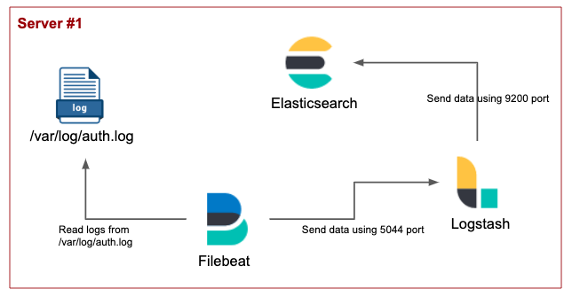

# Environments
* Ubuntu : 18.04
* Elasticsearch : 7.0
* Filebeat : 7.0
* Logstash : 7.0

# Install and run
### 1. Elasticsearch
https://www.elastic.co/guide/en/elasticsearch/reference/current/getting-started-install.html

### 2. Filebeat
https://www.elastic.co/guide/en/beats/filebeat/current/filebeat-installation.html

### 3. Logstash
https://www.elastic.co/guide/en/logstash/current/installing-logstash.html


# Elasticsearch + Filebeat + Logstash
In this section, Filebeat reads the /var/log/auth.log and sends it to Logstash
Logstash filters the input data according to filter section in pipleline.conf
At the end, Logstash sends data to Elasticsearch

### 1. Architecture


### 2. Send auth.log from Logstash to Elasticsearch
Before running Logstash, install and run Elasticsearch
#### 1) Configure Logstash input/filter/output
```shell
# <Logstash home>/config/my_logstash.conf

input {
    beats {
        port => "5044"
    }
}

# The filter part of this file is commented out to indicate that it is
# optional.
# filter {
#
# }

output {
    elasticsearch {
        hosts => [ "localhost:9200" ]
    }
}

```
Run Logstash with my_logstash.conf!!!
  
### 3. Send auth.log from Filebeat to Logstash
Before running Filebeat, make sure running Logstash as described in '2. Send auth.log from Logstash to Elasticsearch'
#### 1) Configure Filebeat input/output
```shell
# <Filebeat home>/my_filebeat.yml

filebeat.inputs:
- type: log
  enabled: true
  paths:
    - /var/log/auth.log
    
output.logstash:
  hosts: ["localhost:5044"]

```
Run Filebeat with my_filebeat.yml!!!


# Questions


# Reference
* https://d2.naver.com/helloworld/3585246


